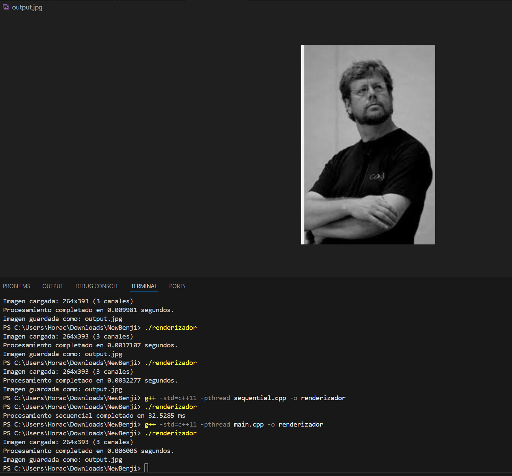
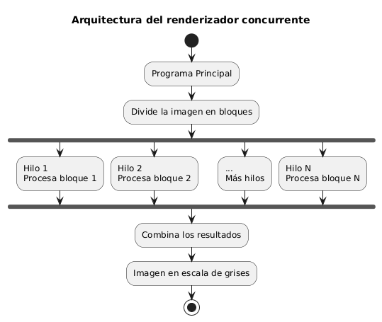

# Concurrencia
## Horacio Villela Hernández  
## A01712206  
## 29/04/2025  

# 🖼️ Renderizador de Imágenes en Escala de Grises

## 📌 Descripción del Proyecto

Este proyecto convierte imágenes a escala de grises usando dos enfoques distintos:
- **Programación concurrente** (utilizando múltiples hilos).
- **Programación secuencial** (una sola línea de ejecución).

El objetivo es demostrar cómo el paradigma de **concurrencia** puede optimizar procesos computacionales intensivos, como el procesamiento de imágenes.

---

## 🧠 Paradigmas de Programación Usados

### 🔄 Concurrencia

La **concurrencia** permite ejecutar varias tareas al mismo tiempo dividiendo el trabajo en **hilos** (`threads`). Es especialmente útil cuando:
- Hay múltiples núcleos de CPU disponibles.
- El problema es **altamente paralelizable** (como recorrer píxeles independientemente).

En este proyecto, la imagen se divide entre varios hilos, y cada uno convierte una parte de la imagen a escala de grises simultáneamente.

### ➖ Secuencial

La **programación secuencial** ejecuta las instrucciones **una tras otra**, en un solo hilo. Aunque es más fácil de implementar, no aprovecha el poder del paralelismo. Aquí, cada píxel es convertido uno por uno en orden.

---

## 🔍 Diferencias entre los enfoques

| Característica        | Secuencial                           | Concurrente                                 |
|-----------------------|--------------------------------------|---------------------------------------------|
| Hilos usados          | 1                                    | Múltiples (`std::thread`)                   |
| Tiempo de ejecución   | Más lento                            | Más rápido (aprovecha CPU multicore)        |
| Complejidad teórica   | O(n)                                 | O(n)                                        |
| Complejidad práctica  | Lenta en imágenes grandes            | Eficiente para cargas grandes               |
| Escalabilidad         | Limitada a un solo hilo              | Escalable con número de núcleos disponibles |

---

## 🧩 Operación Estándar: Conversión a Escala de Grises

En ambas versiones, la operación que se realiza sobre cada píxel es:

Gray = 0.3 * R + 0.59 * G + 0.11 * B

Esta es una **fórmula estándar** en procesamiento de imágenes. Simula cómo el ojo humano percibe los colores, dando mayor peso al verde y menos al azul.

Esta operación se ejecuta **una vez por píxel**.

---

## ⚙️ Bibliotecas utilizadas

| Biblioteca              | Propósito                                      | Fuente / Referencia |
|-------------------------|-----------------------------------------------|----------------------|
| `stb_image.h`           | Leer imágenes JPG, PNG, BMP                   | [stb GitHub](https://github.com/nothings/stb/blob/master/stb_image.h) |
| `stb_image_write.h`     | Guardar imágenes procesadas                  | [stb GitHub](https://github.com/nothings/stb/blob/master/stb_image_write.h) |
| `<thread>`              | Crear y controlar hilos                       | ISO C++ Standard     |
| `<chrono>`              | Medir tiempos de ejecución                    | ISO C++ Standard     |

---

## 🧪 Pruebas

A tomar en consideración, se realizaron las prouebas usando imagenes jpg, asi como sus salida. Podria ocacionar fallas en caso de usar otro archivo de imagen por lo que se recomienda solo usar imagenes con extensión `.jpg`
Se usó una imagen de entrada llamada `input.jpg`.

### Resultados:

| Versión        | Núcleos | Tiempo de ejecución |
|----------------|---------|---------------------|
| Secuencial     | 1       | 32.5285 ms          |
| Concurrente    | 4       | 6.006 ms            |

Estas pruebas se realizaron usando `#include <chrono>`



En caso de realizar pruebas, estan `kirbo.jpg` y `Sore.jpg`.

En caso de realizar pruebas de error, esta `sorita.png`.


---

## 📊 Análisis de Complejidad

### ✅ Versión Secuencial

- Recorre cada píxel una vez: `O(n)`
- `n = ancho × alto` (cantidad de píxeles)
- No hay operaciones anidadas

### ⚡ Versión Concurrente

- Cada hilo procesa una fracción de los píxeles: `O(n/t)` por hilo
- Tiempo total (asumiendo paralelismo ideal): `O(n / t)`, donde `t` = número de hilos
- En práctica sigue siendo `O(n)` por la suma total del trabajo

Ambas versiones tienen **complejidad teórica O(n)**, pero en la práctica, la versión concurrente es mucho más rápida debido a dividir el trabajo en diferentes hilos.

---

## 🏛️ Modelo y Arquitectura

### Diagrama de arquitectura



En este modelo se observa de manera grafica el funcionamiento de los hilos. En este caso en particular al considerar las imagenes como matrices.


### Modelo 1: Procesamiento Multihilo

#### Descripción

En este modelo tratamos a las imagenes en forma de matrices, recorriendolas a traves de una función for

- Se detecta el número de núcleos disponibles del sistema.
- La imagen se divide en secciones horizontales (filas).
- Cada hilo procesa su sección de manera independiente, aplicando el filtro de escala de grises.
- Se espera a que todos los hilos terminen antes de guardar la imagen.

Este enfoque permite aprovechar múltiples núcleos para reducir el tiempo total de procesamiento, especialmente útil para imágenes grandes.

```bash
#main.cpp
for (int y = start_row; y < end_row; ++y) {
        for (int x = 0; x < width; ++x) {
            int i = y * stride + x * channels;
---

### Modelo 2: Procesamiento Secuencial

#### Descripción
En este modelo se tratan a las imagenes de forma lineal, recorriendo la imagen en un  solo bucle
- Se carga la imagen completamente en memoria.
- Se recorre la imagen de forma secuencial, procesando cada píxel uno a uno.
- Cada componente RGB se convierte a escala de grises y se almacena en una nueva imagen.
- Se guarda la imagen resultante al finalizar.

Este método es más simple pero puede ser más lento para imágenes grandes o sistemas con múltiples núcleos disponibles.

```bash
for (int i = 0; i < width * height; i++) {
    int index = i * 3;
```

### Compilación

Asegúrate de tener los archivos `stb_image.h` y `stb_image_write.h` en el mismo directorio que el código fuente.

```bash
g++ -std=c++11 -pthread main.cpp -o renderizador      
g++ -std=c++11 -pthread sequential.cpp -o renderizador
---

## ✅ Conclusión

Este proyecto demuestra cómo la **programación concurrente**, cuando se aplica a problemas paralelizables como el procesamiento de imágenes, puede **mejorar significativamente el rendimiento**, sin cambiar la complejidad teórica.

Se presentan dos soluciones:
- Una **clara y sencilla** con un solo hilo (secuencial).
- Una **más rápida y eficiente** usando múltiples hilos (concurrente).

Ambas están documentadas, probadas y correctamente implementadas.

---
## 📚 Referencias

- Barrett, S. (2023). *stb single-file public domain libraries*. GitHub. https://github.com/nothings/stb  
- ISO/IEC. (2017). *ISO/IEC 14882:2017 - Programming Languages — C++*. ISO.  
- Silberschatz, A., Galvin, P. B., & Gagne, G. (2020). *Operating System Concepts* (10a ed.). Wiley.  
- Rauber, T., & Rünger, G. (2013). *Parallel Programming: for Multicore and Cluster Systems*. Springer.

---


